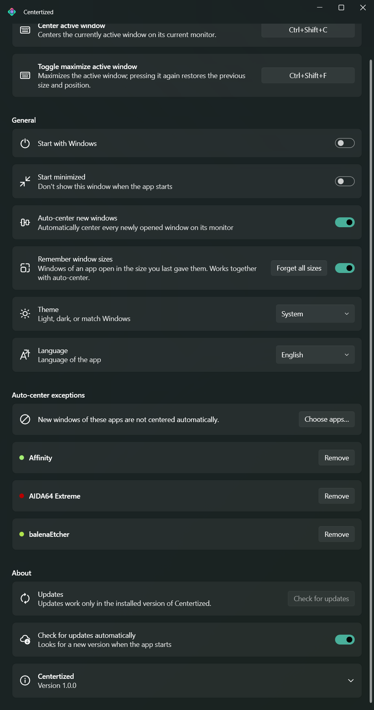
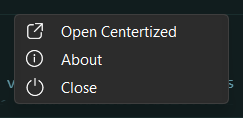
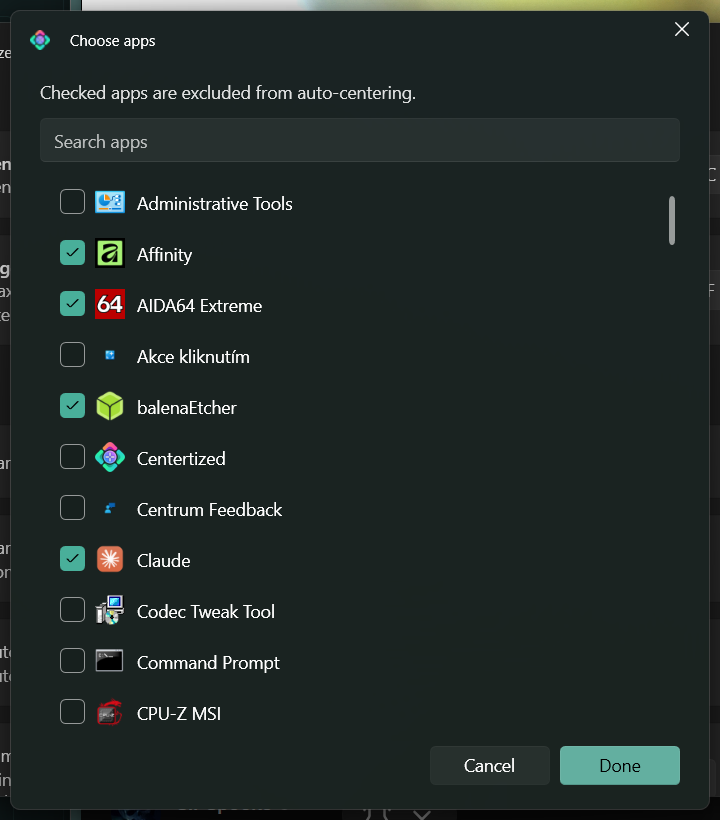

<h1>
  
  Centertized
</h1>

A small native Windows tray app that puts windows exactly where you expect them:
**centered on their monitor**. Press a shortcut to center the active window — or let
Centertized center every newly opened window automatically, in the size you last gave that
app's windows.

Think: "I'm tired of every new window opening in some random corner, or half off-screen, or
at a size I have to fix by hand every single time."



## ✨ What it does

- 🎯 **Center the active window** with a global shortcut (default `Ctrl+Shift+C`, fully
  configurable). The shortcut is checked against other apps at the moment you set it, so
  you find out about a conflict right away instead of wondering why nothing happens.
- 🪄 **Auto-center new windows** — every newly opened window lands in the middle of its
  monitor, before you have to reach for the mouse. Works for classic desktop apps *and*
  modern/Store apps (Settings, Microsoft Store, …). Notifications, overlays and other
  system pop-ups are left alone.
- 📐 **Remembers window sizes per app** — resize a window once and the next window of that
  app opens in that size, centered. It learns by itself from the resizing you already do;
  there's nothing to configure (and one button to forget it all).
- 🚫 **Per-app exceptions** — pick apps that should *not* be auto-centered from a list of
  everything installed (with search and checkboxes, several at once). Your exceptions show
  up in the main window, each with a dot in the color of the app's icon.
- ⤢ **Toggle maximize** — a second shortcut maximizes the active window and, pressed
  again, brings it back to exactly where it was.
- 🌗 **Looks like it belongs in Windows** — Fluent design with Mica backdrop, light / dark /
  follow-Windows theme that switches live, and a genuinely native tray menu.
- 🌍 **English and Czech**, switchable live (follows your Windows language by default).
- 🗂️ **Quiet tray app** — starts with Windows if you want, can start minimized, and closing
  the window just tucks it away into the tray.
- 🔄 **Installer and automatic updates** — a normal Setup.exe, and the app can update itself
  from GitHub Releases.

## 📋 Requirements

- **Windows 10 (2004) or newer**, Windows 11 recommended (Mica, rounded menus and window
  corners are Windows 11 features; everything still works on Windows 10).
- Nothing else to install — the release is self-contained (it ships its own .NET runtime).

## 📥 Installing

### Option A: installer (recommended)

Download `Centertized-win-Setup.exe` from the
[latest release](https://github.com/Meitoncz/Centertized/releases/latest) and run it. It
installs per-user (no administrator rights needed), adds Centertized to the Start menu, and
the app keeps itself up to date from then on (**Settings → About → Check for updates**, or
automatically at startup).

> The installer isn't code-signed yet, so Windows SmartScreen may show a "Windows protected
> your PC" screen on first run — choose **More info → Run anyway**.

### Option B: portable

Download `Centertized-win-Portable.zip`, unzip it anywhere and run `Centertized.exe`.
The portable build doesn't update itself.

### Option C: build from source

```powershell
git clone https://github.com/Meitoncz/Centertized.git
cd Centertized
dotnet run --project src/Centertized
```

Needs the [.NET 10 SDK](https://dotnet.microsoft.com/download).

## 🚀 Using it

1. **Start it.** The settings window opens on first launch; closing it hides Centertized to
   the tray (a one-time hint tells you where it went). Click the tray icon to reopen it, or
   right-click for **Open Centertized / About / Close**.

   

2. **Shortcuts.** Click a shortcut button and press the combination you want. It needs at
   least one of Ctrl / Alt / Shift / Win.
3. **Auto-center new windows.** Turn it on in **General**. From now on new windows open
   centered.
4. **Remember window sizes.** Also in **General** (on by default): resize any window and
   Centertized remembers that size for the app. **Forget all sizes** resets it.
5. **Exceptions.** Under **Auto-center exceptions** press **Choose apps…**, tick the apps
   that should keep opening wherever they like, and press **Done**.

   

## ⚠️ Things to watch out for

- **Administrator windows can't be moved.** Windows doesn't let a normal app move the
  windows of an elevated one (that's UIPI, a security boundary, not a bug). Centertized
  runs without elevation on purpose.
- **Windows without a title bar aren't auto-centered.** Auto-centering only touches regular
  windows with a title bar — that's what keeps notifications, overlays and pop-ups where
  they belong. The shortcut still works on anything. (Apps that draw their own custom title
  bar without the standard window frame fall into the "left alone" group too.)
- **Windows-key shortcuts.** `Win + F1…F24` work, but `Win + letter/number` can't be
  captured: Windows claims those before any normal app sees them.
- **Conflict detection has limits.** Centertized can tell when another app already
  registered the same shortcut the standard way. Apps that listen for keys with a low-level
  keyboard hook can't be detected in advance — Windows offers no way to ask.
- **A brief jump is normal for some modern apps.** Store apps such as Settings finish
  opening slightly *after* Windows announces them, so Centertized centers them a moment
  later and you may see them hop into place. Windows has no way to move another app's
  window before its first frame is drawn, so this can be minimized but not fully removed.
- **Some apps position themselves.** An app that restores its own saved position after
  opening can fight the centering; add it to the exceptions list.

## 🛠️ For developers

Architecture notes, the reasoning behind the trickier fixes, and things not to "fix" live
in [`CLAUDE.md`](CLAUDE.md) — written for AI-assisted development but equally useful as a
technical deep-dive for a human contributor.

```
src/Centertized        WPF app: tray, windows, localization, updates
src/Centertized.Core   Win32 interop, hotkeys, centering logic, settings (no WPF dependency)
src/Centertized.Tests  xUnit tests for Core
```

```powershell
dotnet build            # build everything
dotnet test src/Centertized.Tests
```

- Every push and pull request runs `.github/workflows/ci.yml` (build + tests).
- Pushing a version tag (`git tag v1.0.1 && git push --tags`) runs
  `.github/workflows/release.yml`: it builds a self-contained package, creates the
  installer and update packages with [Velopack](https://velopack.io), and publishes them as
  a GitHub Release — which is also where installed copies look for updates.

## ⚖️ License

GPLv3 — see [`LICENSE`](LICENSE) for the full text.

## 📝 Changelog

### v1.0.0 — Initial release

- 🎯 Center the active window with a configurable global shortcut, with shortcut-conflict
  detection.
- ⤢ Toggle maximize / restore-to-previous-position shortcut.
- 🪄 Auto-center new windows, including modern/Store apps; notifications and overlays are
  left alone.
- 📐 Automatic per-app window size memory.
- 🚫 Per-app exceptions with a searchable app picker.
- 🌗 Fluent UI with Mica, live light/dark/system theme, native tray menu, English and Czech.
- 🔄 Installer and automatic updates via GitHub Releases.

## 💬 Disclaimer

I built Centertized primarily for myself: I wanted new windows to just open in the middle of
the screen, at a size that makes sense, without a pile of window-manager tooling I didn't
need.

Centertized was built with the help of AI, but I'm a technically grounded person with years
of professional experience in the IT industry — every part of this project has been
directed, reviewed, and tried out for real by me, not just prompted and shipped blind.
Getting from "technically working" to something that actually feels right took a lot of
hands-on iteration on a real desktop: pixel-level tweaks to the interface, chasing bugs that
only showed up with specific apps (modern Store apps, notifications, overlays), and more
than one wrong turn that had to be undone. The details are in the commit history and
[`CLAUDE.md`](CLAUDE.md).
